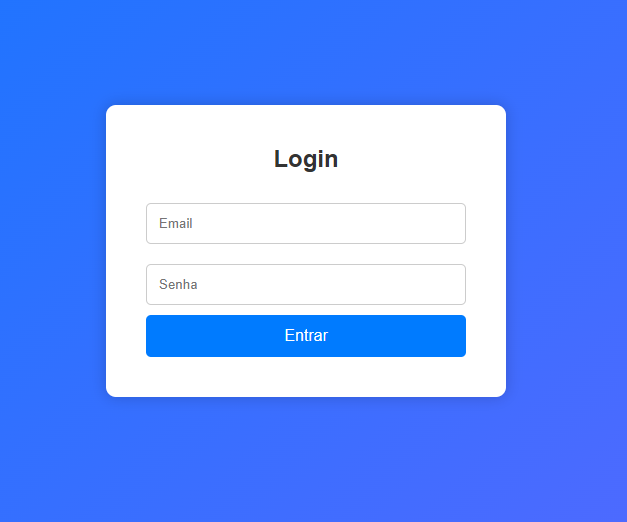

# 🔐 Página de Login Simples

Este projeto é uma interface de login desenvolvida com **HTML5** e **CSS3**, com foco em simplicidade, clareza e design responsivo. Ideal para aplicações web, estudos de front-end e páginas de autenticação.

## 📸 Preview

> 

## 💡 Funcionalidades

- Layout moderno e responsivo
- Campos com validação básica (HTML)
- Estilização com gradiente linear
- Design limpo e acessível

## 🛠 Tecnologias

- HTML5
- CSS3

